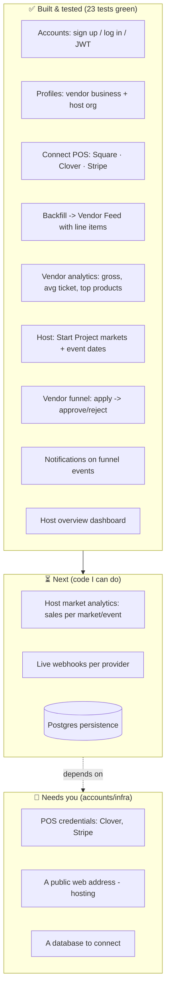
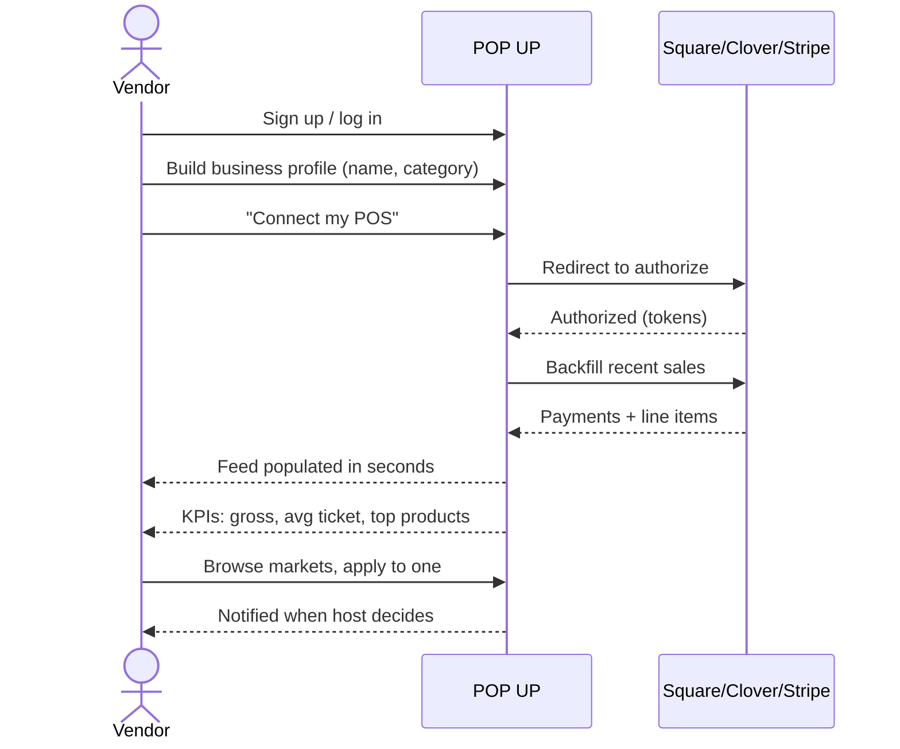
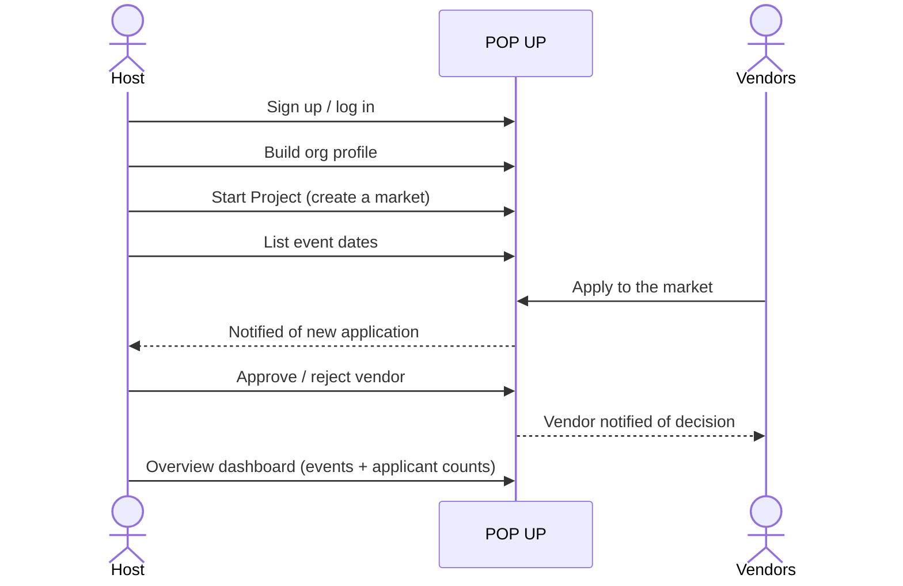

# POP UP — Progress & App Flow

_Focus: **Vendors first, then Hosts.** Shopper-facing work is deprioritized._

## Build progress

## Vendor flow (the primary user)

## Host flow (secondary user)

## API surface today

| Area | Endpoints |
| --- | --- |
| Auth | `POST /auth/signup` · `POST /auth/login` · `GET /auth/me` |
| Profile | `GET /profile/me` · `PUT /profile/me` |
| Connect POS | `GET /connect/:provider/{url,callback,status}` (square·clover·stripe) |
| Feed | `GET /feed` |
| Analytics | `GET /analytics/me` |
| Markets | `POST/GET /markets` · `GET /markets/:id` · `POST/GET /markets/:id/events` |
| Funnel | `POST/GET /markets/:id/applications` · `PATCH /markets/:id/applications/:appId` |
| Host | `GET /host/overview` |
| Notifications | `GET /notifications` · `POST /notifications/:id/read` · `POST /notifications/read-all` |
| Webhooks | `POST /webhooks/pos/:provider` |
