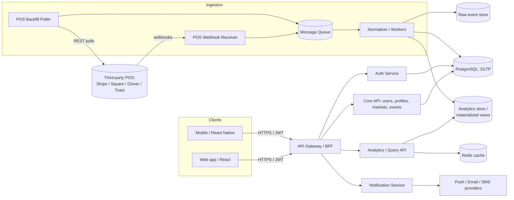
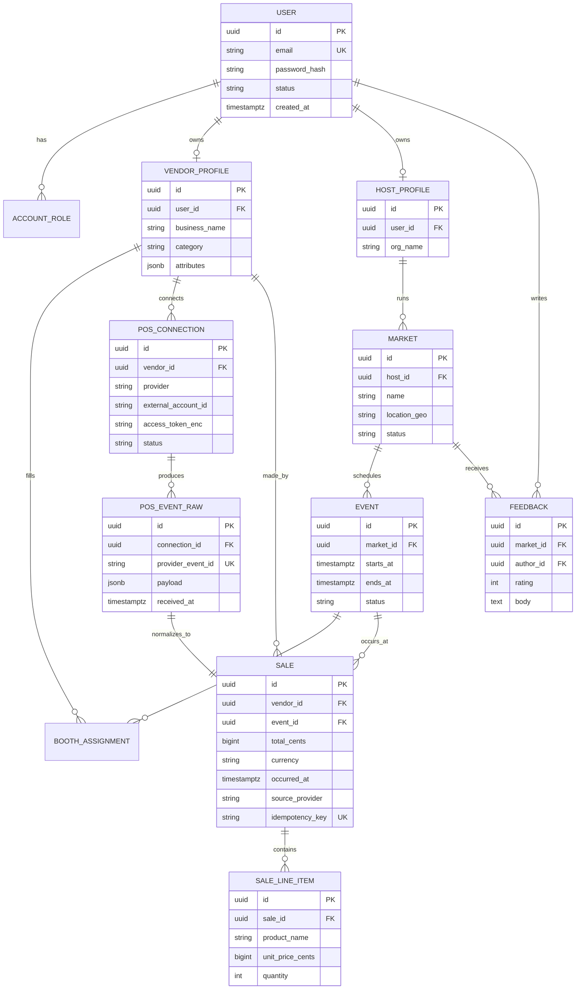

# POP UP — Technical Software Spec (V1)

> A modular vendor & host analytics platform for the pop-up market ecosystem.
> Sales data is ingested from third-party Point-of-Sale providers (Stripe, Square,
> Clover, Toast, …), normalized, and turned into analytics, KPIs, and market history
> for **Hosts** (run markets) and **Vendors** (sell at markets), with a future
> read-only tier for **Shoppers**.

- **Status:** Draft V1 (spec only — no implementation yet)
- **Owner:** Israel K. Rod
- **Last updated:** 2026-05-19

---

## 1. Goals & Non-Goals

### 1.1 Product goals
- Give a **first-day vendor the analytics of a franchise**: KPIs, product-level
  performance, comparable markets, and area demand — with near-zero manual data entry.
- Give **hosts** the tools to start, fill, and refine a market: a `Start Project`
  flow, event/date listing, a vendor funnel, and per-market profitability history.
- Make **data the value proposition**: insights on products, peer businesses, and
  local markets, plus a durable digital footprint for the pop-up ecosystem.

### 1.2 Engineering goals
- Ingest POS sales **reliably and idempotently** via webhooks + backfill polling.
- Normalize heterogeneous POS payloads into one canonical sales model.
- Serve **live KPIs** during an event and **historical analytics** after.
- Be **multi-tenant**, secure with sensitive financial data, and horizontally scalable.

### 1.3 Non-goals (V1)
- We are **not** a POS. We never take payments; we read settled/transaction data.
- No native shopper marketplace/checkout in V1 (shopper tier is read-only later).
- No custom ML demand-forecasting in V1 (descriptive analytics first).

---

## 2. Personas & Core Use Cases

| Persona | Primary jobs-to-be-done |
| --- | --- |
| **Vendor** | Connect POS, see live sales KPIs at an event, compare markets, decide where to sell next. |
| **Host** | Create a market (`Start Project`), list event dates, recruit/approve vendors, see market profitability. |
| **Shopper** (later) | Browse upcoming markets, vendors, and public history. |
| **Admin/Internal** | Moderate content, manage POS connector health, observe ingestion pipeline. |

Key flows: **sign up / log in → build profile → connect POS → join/host a market →
ingest sales → view dashboards → receive notifications → review history & feedback.**

---

## 3. High-Level Architecture

**Why this shape**
- A **dedicated ingestion path** (webhook receiver → queue → workers) isolates
  bursty, untrusted third-party traffic from the user-facing API and lets us absorb
  spikes (a busy market = thousands of transactions/minute) without dropping data.
- A **raw event store** keeps the original POS payload immutable for replay/audit; the
  **normalizer** is the only thing that writes canonical sales rows.
- **OLTP (Postgres)** for transactional truth; **OLAP/materialized views + Redis** for
  fast dashboard reads, so analytics queries never block writes.

---

## 4. Recommended Technology Stack

| Layer | Choice | Rationale |
| --- | --- | --- |
| Language/runtime | **Node.js 22 (ESM) + TypeScript** | One language across API + workers; strong typing for money/financial models. |
| API style | REST + JSON (BFF/gateway) | Simple, cacheable, easy for mobile & third parties. GraphQL optional later for dashboards. |
| Web client | React + Vite | Mature charting ecosystem (Recharts/visx). |
| Mobile | React Native (shared TS models) | Vendors need live KPIs "on the go." |
| OLTP DB | PostgreSQL | Relational integrity for users/markets/events; JSONB for flexible POS metadata. |
| Analytics | Postgres materialized views → ClickHouse/BigQuery if volume demands | Start simple, migrate hot paths only when needed. |
| Cache/queue | Redis (cache) + a managed queue (SQS / RabbitMQ / BullMQ) | Decouple ingestion; idempotent retries. |
| Auth | JWT access + rotating refresh tokens; OAuth2 for POS connectors | Stateless API auth; POS access via provider OAuth. |
| Tests | **Jest** | Per project decision. |
| Infra | Containers (Docker) + IaC; horizontal autoscaling on ingestion workers | Scale the spiky part independently. |
| Observability | Structured logs, metrics, tracing on the ingestion pipeline | Connector health is operationally critical. |

---

## 5. Data Model (canonical)

**Money rule:** all monetary values are stored as **integer minor units (`*_cents`)
with an explicit `currency`** — never floats. This is enforced at the type level and
in the ingestion normalizer.

---

## 6. Key Subsystems

### 6.1 POS ingestion (the core technical challenge)
1. **Webhook receiver** verifies the provider's HMAC signature against the **raw
   request body** (parsing first breaks verification), checks timestamp skew, and
   immediately persists the raw event + enqueues a job. It returns `2xx` fast so the
   provider doesn't retry-storm us.
2. **Idempotency:** every raw event carries a `provider_event_id`; the normalizer
   keys canonical `SALE` rows on a derived `idempotency_key`, so replays/duplicates
   are no-ops.
3. **Normalizer workers** translate provider-specific payloads → canonical `SALE` +
   `SALE_LINE_ITEM`, attach `vendor_id`/`event_id` (by connection + time window),
   and write OLTP + analytics rows.
4. **Backfill poller** reconciles missed webhooks via provider REST APIs (handles
   downtime and providers without webhooks).

> The representative `tempFunction` exercise (`src/tempFunction.js`, with its review in
> `docs/tempFunction-review.md`) implements step 1's signature-verified, idempotent
> webhook intake as a worked example of this subsystem.

### 6.2 Analytics & dashboards
- **Live KPIs** (during an event): gross sales, transaction count, avg ticket, top
  products — read from Redis-cached rollups updated by the normalizer.
- **Historical/market analytics:** profitability per event/market, vendor comparisons,
  area/category benchmarks — served from materialized views, refreshed on a schedule.
- **Comparables** ("franchise on day one"): aggregate, **anonymized** peer benchmarks
  by category + geography, never exposing another business's raw sales.

### 6.3 Markets, events & the `Start Project` flow
- Host creates a `MARKET` → defines one or more `EVENT` dates → opens a **vendor
  funnel** (applications/invites) → approves `BOOTH_ASSIGNMENT`s. All tied to the
  host account and viewable in history with `FEEDBACK`.

### 6.4 Notifications
- Event lifecycle (created/updated/cancelled), vendor application status, ingestion
  health ("POS disconnected"), and analytics digests — via push/email/SMS with
  per-user preferences.

---

## 7. Security & Privacy

- **Financial data is sensitive.** Encrypt POS access tokens at rest; never log raw
  payloads with PII; scope OAuth to the minimum needed.
- **Webhook trust:** verify HMAC over the raw body with a per-connection secret;
  enforce timestamp tolerance to block replay; use constant-time comparison.
- **SQL safety:** parameterized queries only — no string-built SQL.
- **Multi-tenant isolation:** every analytics query is scoped by `vendor_id`/`host_id`;
  comparables are aggregated + k-anonymized.
- **AuthN/Z:** JWT access + refresh rotation; role-based access (vendor/host/admin).

See `docs/tempFunction-review.md` for a concrete security walkthrough of the webhook path.

---

## 8. Scaling & Processing

- **Scale the spiky part independently:** ingestion workers autoscale on queue depth;
  the user API scales on request load. They don't share a failure domain.
- **Backpressure:** queue absorbs market-rush bursts; receiver stays cheap and fast.
- **Read scaling:** Redis for hot KPIs, materialized views for history, read replicas
  for heavy analytics; promote hot tables to a columnar store (ClickHouse/BigQuery)
  only when Postgres rollups stop keeping up.
- **Idempotent everything** so retries/replays are safe under load.

---

## 9. Milestones

1. **M0 — Foundations:** auth, profiles, DB schema, CI + Jest harness.
2. **M1 — Ingestion MVP:** one provider (Stripe), webhook receiver + normalizer +
   raw store + idempotency (the `tempFunction` path productionized).
3. **M2 — Markets/Events:** `Start Project`, event dates, vendor funnel, notifications.
4. **M3 — Analytics:** live KPIs + historical dashboards + comparables.
5. **M4 — More connectors:** Square/Clover/Toast + backfill poller.
6. **M5 — Shopper read tier + hardening/scale.**

---

## 10. Open Questions
- Which POS provider is the launch partner (drives connector priority)?
- Revenue model — does it change what comparables we can expose?
- Data retention/residency requirements for financial data by region?

---

*Reply **"build"** to begin implementation against this spec; I'll implement
milestone by milestone and you can interject with **"continue"**.*
